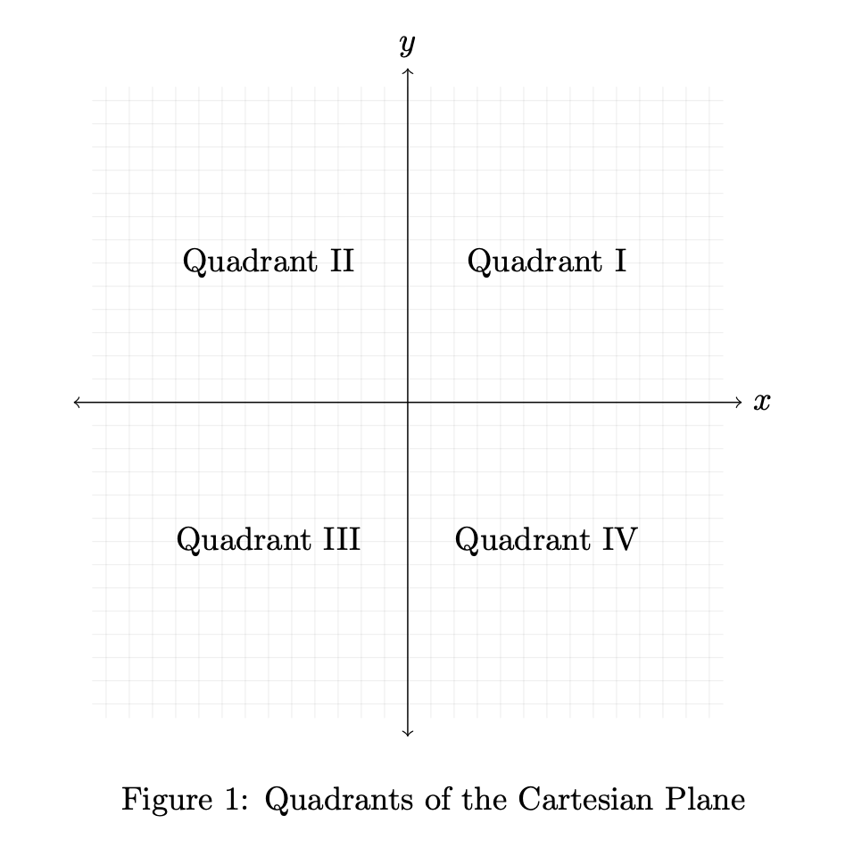

# Computer Science II
## Assignment 0.0
### Spring 2026
---

# Overview

In the first assignment (numbered 0 because all self-respecting computing
professionals start counting at 0), we'll focus on getting used to your
new language (Java or Python) by doing some simple standalone programs.  
Follow instructions **carefully**, failure to do so may result in
points being deducted.  

* For this first assignment, all work must be your own, no partners or
  collaboration with other student(s) is allowed.  The usage of any AI
  tools is strictly prohibited.  However, you may
  discuss problems *at a high level*.  The School of Computing's
  Academic Integrity Policy is in effect: <https://computing.unl.edu/academic-integrity-policy>

* Hand in all your source files and other artifacts through the webhandin
  and verify your programs are correct by running the grader.  

* **For those in the main section(s)**: your programs must be
  written in Java, should accept command line arguments as specified,
  and execute successfully on the grader.  All your classes should
  be in the `unl.soc` package and your source files should have the
  following names:
    * `Point.java`
    * `FloodUtils.java` (as well as the two JUnit files we've provided)
    * `TransactionReport.java`
  However, you are allowed and encouraged to submit any additional
  supporting files as long as they work on the grader.

* **For those in the honors section**: your programs must be written
  in python (unless you have no prior Java experience, in which case,
  you should do the Java version), should accept command line arguments
  as specified, and execute successfully on the grader.  Your source
  files should have the following file names:
    * `point.py`
    * `flood_utils.py` (as well as the test file we provided)
    * `transaction_report.py`
  However, you are allowed and encouraged to submit any additional
  supporting files as long as they work on the grader.

# Exercises

## Exercise 1 - Point Data (Basic I/O)

Consider a point $(x, y)$ in the cartesian plane.  The point may
lie in one of four *quadrants* as depicted in the figure below.
Alternatively, if the point lies on the `x-axis`, `y-axis`, or
at the `origin` then it does not lie in one of the quadrants.



In addition, there are two notions of distance from the origin,
$(0,0)$ to the point $(x,y)$; one is the *Manhattan distance*
which is calculated as:
  $$|x| + |y|$$
which measures the distance you'd have to travel horizontally/vertically
to reach $(x,y)$.  The second notion is the usual euclidean distance
calculated as:

$$\sqrt{ x^2 + y^2 }$$

Write a program that reads in $x$ and $y$ and outputs *where* the
point is located (with respect to quadrant or axis) and the two
*distances* from the origin.

For example, if we invoke your program from the command line using

`./a.out 2.4 3.9`

it would correspond to the point $(2.4, 3.9)$ and your output
should look something like the following.

```text
Point: (2.400000, 3.900000)
Location:           Quadrant I
Manhattan Distance: 6.300000
Euclidean Distance: 4.579301
```

## Instructions

* You should perform some basic error checking and
  input validation, exiting with an appropriate message.
* Verify all the tests pass; you may resubmit as many times
  as you like until the due date.

## Exercise 2: Flood Utility Functions (Arrays, Testing)

### Waterway Flow Conversion

Consider a waterway (such as a canal) with monitoring stations at various intervals.
At each interval the monitoring station reports a cross-sectional area of water
in square meters ($m^2$).  This data is stored in a 1-D array; for example:

`{350, 352.5, 351.2, 355.2, 354.0}`

Implement a method that converts this array to square feet (sqft) but
in a *new* array that is to be returned from the method.  Note that 1
square meter = 10.76391 square feet.

### Flood Capacity

In order to predict flood conditions, the engineers have produced a
grid of elevations in an area which is represented as an `n x m`
two dimensional array of floating point numbers.  For example, the following
is a `3 x 5` grid:

```text
{ 9.50, 4.75, 7.25, 8.25, 8.25 }
{ 8.50, 9.35, 6.45, 6.50, 7.25 }
{ 7.50, 8.60, 4.50, 5.50, 5.75 }
```

The *potential flood capacity* of an area is computed by taking a
potential *flood level* and summing the differences at each point.

For example, if the potential flood level were `6.0` then any location
that was *less* than `6.0` would be flooded.  
For the grid example above: the first location has an elevation of `9.5`
which is *above* the `6.0` water level and so is not flooded.  The
second (in the first row) is `4.75` which is *below* the water level, so there
are `6.0 - 4.75 = 1.25` meters of flood water.  When we sum up all such
differences in the example above we get total of 3.5 meters of flood water
over the entire grid.

### Instructions & Unit Testing

For the Java version, we have provided a starter file with specific method
signatures.  We have also provided JUnit starter files that
have several test cases already written.  In addition to implementing all methods
as specified, you will be required to *add* additional test cases to the JUnit
testing suite.  Specifically, you need to add **at least 2 valid test cases** *for
each method* you need to implement.  

For the Python version, we have provided a starter file with specific function
signatures.  We have also provided a `unittest` starter file that
has several test cases already written.  In addition to implementing all function
as specified, you will be required to *add* additional test cases to the `unittest`
testing suite.  Specifically, you need to add at least 2 valid test cases *for
each function* you need to implement.  

## Exercise 3: Financial Reports

Data processing is fundamental to Computer Science and many other
disciplines. In this hack you will start a mini-project in which you
will process a large amount of transaction data from a financial
institution. The data represents transactions that transfer funds from
or to an account (this data is derived from financial data generated by
PaySim, a transaction simulator: <https://www.kaggle.com/ntnu-testimon/paysim1>).

## The Data

Transaction data is represented as a flat file in CSV format. The first
line indicates how many records are contained in the file. Each
subsequent line represents a single transaction. A transaction includes
the following pieces of data:

-   A universally unique identifier (UUID), an alphanumeric designation
    that uniquely identifies the transaction

-   The type of transaction, which may be one of the following:
    `PAYMENT`, `TRANSFER`, `WITHDRAWAL`, `DEBIT`, `DEPOSIT`

-   The amount of the transaction

-   The customer account number

-   The customer account balance before the transaction

-   The customer account balance after the transaction

-   The transfer account number or merchant designation identifying
    where the funds are sent

A small example:

```text
10
BC377639-37CC-4824-81AF-60177418B46D,PAYMENT,14535.18,C1906093041,83310.00,68774.82,M95867054
A35686EA-BFE7-455E-A027-54D73968E6D3,PAYMENT,11367.98,C371579810,77199.32,65831.34,M1932650331
7721D4C1-5A2E-4AA0-8AC3-351DFC4FE84A,DEPOSIT,159266.75,C1387043512,7777736.40,7937003.15,C553899299
F8A44740-DE85-4477-9E5E-C090AABE0BF2,WITHDRAWAL,79628.70,C739752704,203042.00,123413.30,C579345824
043FD663-236E-4C02-B042-E2642AA6471E,DEBIT,3225.27,C750937249,99375.00,96149.73,C1232504595
E0EB18EC-4EE2-4206-8834-9465992D1B28,PAYMENT,11268.73,C385148617,167267.40,155998.67,M1084205719
C306CA7E-80A0-499E-8CDE-13DFB50C6753,PAYMENT,17526.96,C1474376627,332543.08,315016.12,M1944361847
003C45B2-1356-4C7F-8D8A-EBB7BF026F16,DEPOSIT,149504.20,C386278926,56082.00,205586.20,C1113941243
B7ECC2F3-E455-4EF8-B4DF-55150A9F3B1F,PAYMENT,7676.11,C2018933315,542758.39,535082.28,M1018630839
76947698-1302-47D9-9CAF-66F21A2A6A52,PAYMENT,3240.99,C208944046,4778.00,1537.01,M962275185
```

## Reports

### Report 1: Totals

Your first report will report the totals for each type of transaction; both
the total number of transactions as well as a total of all amounts of those
transactions.  For example, the input above should produce a report that looks
something like the following.

``` text
=======================================
Totals Report
=======================================
Type            Count             Total
=======================================
Payment             6  $       65615.95
Transfer            0  $           0.00
Withdraw            1  $       79628.70
Debit               1  $        3225.27
Deposit             2  $      308770.95
=======================================
Total              10  $      457240.87
```

### Report 2: Validation

A fundamental operation of data processing is *data validation*.
For this part, we will ensure that all transactions are *consistent*.  
For example, in our transaction data, the difference in the account
balance before and after the transaction *should* be equal to the
amount of the transaction.

Note that deposit transactions should *increase* the balance of
the account while other transaction types *decrease* the balance
of the account.  Add to your program, code that produces a report of
all invalid transactions.  Your report should include a list of all
invalid transactions as well as an indication of *why* they are
invalid.  Include a summary of the number of invalid transactions as
well as a total of how much they are off by.  An example:

```text
===================================================
Balance Validation Report
===================================================
  Invalid Transaction, off by $0.01:
	003C45B2-1356-4C7F-8D8A-EBB7BF026F16: C386278926  -> C1113941243
	( Deposit) $ 149504.20 ($56082.00 -> $205586.19)
  Invalid Transaction, off by $103.00:
	1DBB66AE-9222-4D3D-8651-BAB82CB48488: C1824038590 -> C621979846  
	( Deposit) $ 270574.43 ($119.00 -> $270590.43)
  Invalid Transaction, off by $-100.00:
	1F5B3912-352E-412D-AEF7-4ED65BF38CE0: C327263195  -> C956086567  
	( Deposit) $ 281292.06 ($17468.00 -> $298860.06)
  Invalid Transaction, off by $0.01:
	458BF06E-1E34-4E1B-9656-7D78032C70E0: C1325645367 -> M1735850501
	( Payment) $   4319.43 ($15463.00 -> $11143.58)
Number of invalid balances found: 4
```

### Report 3: Fraud Detection

Databases are frequently backed up at regular intervals called "snapshots."
Consider the following scenario: a financial auditor suspects that an employee
has committed fraud by modifying transactions by modifying the amounts involved
or the balances or the account numbers or even deleting transactions
entirely.  

Help the auditor identify potential issues by comparing two database snapshots
and finding any data anomalies between them.  Given two database snapshots,
you should find any transactions that disagree in any way (account numbers,
amounts, balances, etc.) or any transactions that are in one snapshot but not
the other.  

Given two database snapshots (one previous to the suspected fraud and one after)
find any data anomalies such as:
  * "missing" or "new" transactions: a transaction that
  appears in one snapshot but not the other
  * a transaction such that the amounts or balances have been
  modified (they differ in the two snapshots)

Example:
```text
Missing transaction:
  4836A6C0-FDFE-4107-8A7F-5BA8C941BB3E in database A but not in B
Inconsistent data:
	A: BC377639-37CC-4824-81AF-60177418B46D: C1906093041 -> M95867054   
	   ( Payment) $  14535.18 ($83310.00 -> $68774.82)
	B: BC377639-37CC-4824-81AF-60177418B46D: C1906093041 -> M95867054   
	   ( Payment) $  14530.18 ($83310.00 -> $68774.82)
Inconsistent data:
	B: BC377639-37CC-4824-81AF-60177418B46D: C1906093041 -> M95867054   
	   ( Payment) $  14530.18 ($83310.00 -> $68774.82)
	A: BC377639-37CC-4824-81AF-60177418B46D: C1906093041 -> M95867054   
	   ( Payment) $  14535.18 ($83310.00 -> $68774.82)
Missing transaction:
  C306CA7E-80A0-499E-8CDE-13DFB50C6753 in database B but not in A
Total missing records:      2
Total inconsistent records: 2
```

Note: the databases you will run reports on will be moderately large (millions
of records).  You will *not* be able to use a "brute-force" solution
that tests every pair of transactions between the two files (which would be
trillions of operations).  Instead, you will need to be more clever in the solution
you design.

## Instructions

* Your program will accept two file names as command line arguments.  The first
  file will be used for the first two reports; both files will be used for the
  third.

# Installing and Using JUnit 5 in Eclipse

## Installing

First, we need to add the JUnit library to your project.  First: make
sure you are in your *Java Perspective* (*not* the "Java EE" perspective).

1. Right-click your project in the Project Explorer
2. Select "Build Path" and then "Add Libraries..."
3. Select JUnit then "Next"; make sure to select JUnit 5 and click "Finish"

You should be able to copy any provided JUnit source code
into your project now.  

## Using JUnit

To run a JUnit test suite, simply open the testing file and hit the
"play" button as you would a normal program.  Eclipse will
automatically compile a report of the number of tests passed or
failed along with any messages provided for failed test cases.

Note that there is no `main` method in a JUnit test suite.  Instead,
JUnit uses "reflection" to automatically find unit tests (methods
identified by the `@Test` annotation) and run them.  

## Optional Project Setup

In larger Java projects it is typical to keep source code and
testing code in separate locations.  With JUnit this is usually
done by putting source code in a `src/main/java` folder and JUnit
test code in a `src/test/java` folder.  In addition, JUnit tests are
usually located in the same package structure as the classes
they are testing.

To setup your Eclipse project this way:
1. Right-click your project and select "Build Path" and select "New Source Folder"
2. Create the source folder `src/main/java` (repeat this for `src/test/java`)
3. Move any code you might have had in the original `src` folder to the appropriate new folder

# Rubric

Each exercise will be graded based on the following items.  However, exercise
three will have a total of 41 correctness points.

## Style (2 pts)

-   Appropriate variable and function/method identifiers

-   Style and naming conventions are consistent

-   Good use of whitespace; proper indentation

-   Clean, readable code

## Documentation (2 pts)

-   Well written comments that clearly explain the purpose of each
    non-trivial piece of code

-   Comments explain the "what" and "why"

-   Comments are not overly verbose or overly terse

-   Code itself is "self-documenting"; it explains the "how"

## Program Design (5 pts)

-   Code is well-organized and efficient

-   Code is modular; substantial pieces of it could be reused; few
    redundancies

-   Code is easily understood and maintainable

-   It is clear that sufficient testing has been performed

-   Corner cases and bad input have been anticipated and appropriate
    error handling has been implemented

## Program Correctness (16 pts)

-   Source code compiles and executes as expected

-   Program runs as specified: correctly reads any input; correctly
    formatted output

-   Test cases successfully execute
