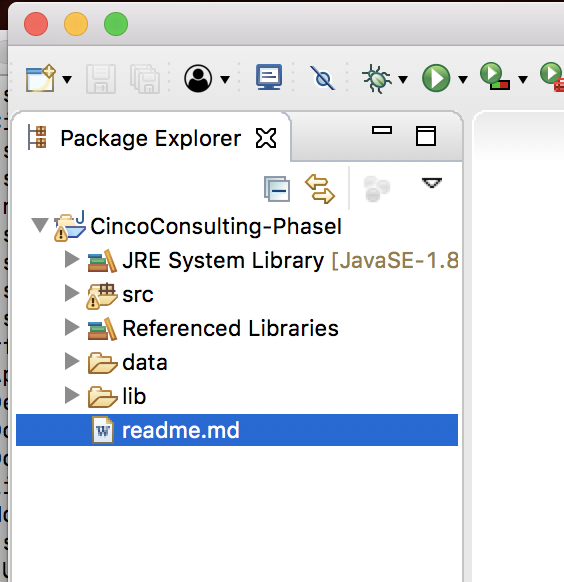

# Computer Science II
## Project Overview
### Spring 2026
---

> If you don't have the time to do it right, then you'll have to find
> the time to do it over.

# Introduction

Over the course of this semester, you will incrementally build a
substantial database-backed application in Java. In each phase of the
project you will focus on a particular component, which will have
*deliverables* that you must hand in by a certain date. These
deliverables may include a Java Archive (JAR) file, source code,
non-trivial test cases, database schemas and a well-written technical
design document.

Each phase builds upon prior phases and may also require updates and
modifications to prior phases. It is important that you understand the
entire scope of the project. You should read all of the assignments to
get a better understanding of where the project will be going.

The iterative nature of this project means that it is *vital* that you
do not fall behind. In each phase it is also important that you have a
good, well-thought design to make subsequent phases easier to design,
extend and implement. Poor designs, bad implementations, bugs and broken
code will mean subsequent phases of this project will suffer. Investing
your time and resources upfront will minimize your *technical debt* and
mitigate the need to update or refactor your design later on. Remember
one of the Golden Rules of coding: only code that which you would not
mind having to maintain.

# Problem Statement

Cinco Computer Consultants (CCC) is a regional company
that provides computer services to other businesses including
equipment and services such as training, consultations and licenses.
Though the services that CCC supplies are state-of-the art, its
business computing systems are not.  They currently use
ad-hoc excel pages and an MS Access database to keep track of everything.
The CEO, Steve Brule wants to
update all business operations with newly developed systems for inventory,
marketing, delivery, invoicing, and sales.  Each system will be independently
developed; **your** team's responsibility is to develop the invoice subsystem
that will be responsible for keeping track of all invoices and billing in a
database-backed system.  The system will also be responsible for producing
several different reports.

It will be your responsibility to design a new system from scratch that
is object oriented, written in Java, and supports CCC's business model
by implementing their business rules and providing the functionality as
detailed below.

Every item that appears on a CCC invoice is uniquely identified with a
Universally Unique ID (UUID) and has a human-readable name.  For each
specific type of item that can appear on an invoice, there is additional
data.

-   **Equipment** includes various computer and electronic
  	products that CCC sells to its clients as a reseller.  All
	  equipment has a price-per-unit cost.  When equipment
	  is *purchased*, the total cost is the price-per-unit
	  times the number of units on the invoice.  There are no
	  additional fees or other costs for equipment.

    When equipment is *leased* it is for a term of a number of
    *months*.  The cost per month is calculated as the purchase
    price plus a 50% markup amortized over a 3 year period (divided by 36).
    On the invoice, the customer is *only* charged for the initial month
    (future billing is handled by a separate system).  Multiple
    pieces of equipment may be leased for the same terms.

-   **Services** are also offered by CCC including consultations,
    training, troubleshooting, installation, etc.  Services are
    associated with a consultant (a person) and are billed
	  to the client on a per-hour basis.  In addition to the hourly cost,
	  there is a flat \$125 service fee.  When invoiced, a service has a
    total number of billable hours.  Thus, the total cost is
    the hourly rate multiplied by the number of billable hours plus
    the service fee.

-   **Licenses** include things like software, server hosting, or
    third-party services.  Licenses also carry a service fee, but the
    amount is different for each license.  In addition, each license
    also has an annual license fee.  When a license is included in an
    invoice, it has effective dates: a beginning and end date to determine
    billing.  The total cost of a license is the number of days included
    in the effective dates divided by 365 multiplied by the annual service
    fee plus the flat service fee.

The invoicing system will keep track of *invoices* which are a collection of
items charged to a particular customer.  Each invoice includes:

-   A UUID

-   The date that the invoice was created

-   The customer (and their info) that the invoice is for; VGB is a B2B
    (business-to-business) operation and so customers are *companies* with
    a name, address, and a primary contact (person).

-   The saleserson that was responsible for the sale

-   The items that were part of the invoice

Depending on the customer and items on the invoice, various taxes may also
applied.

-   Purchased equipment has a 5.25% use tax applied.  However, when leased
    the taxes are based on the total price of the lease: any equipment
    less than $2,000 has no tax; for leases costing $2,000 but less than $7,000
    a flat tax of $175 is applied; for all leases $7,000 or more, a tax
    of $350 is applied.  

-   All services have a 3.15% sales tax rate

-   No tax is applied to licenses

**Note**: for all dollar values, the system will need to round to the
nearest cent.

# Project Outline

Over the course of this semester you will iteratively design an
application to support this business model. Development has been broken
down into 6 phases:

-   Phase I: Data Representation & Electronic Data Interchange (EDI) --
    in the first phase you will design and implement the objects that
    will form a basis for the system and create parsers to read data
    from flat files, generate instances of your objects and export them
    to an interchange format (XML and/or JSON).

-   Phase II: Hierarchy Design & Implementation -- In this phase you will
    further refine your objects and define relationships between them.  You
    will test your implementation by developing a small JUnit testing suite.

-   Phase III: Summary Reports -- You will write additional parsing code
    to read full invoice data from flat files and produce several reports.

-   Phase IV: Database Design -- This phase focuses on designing a
    relational database to model your objects and support your
    application

-   Phase V: Database Connectivity -- You will refactor your code to
    load your objects to your database rather than from flat files

-   Phase VI: Database Persistence -- You will implement and use an API
    to persist (save) data to your database.

-   Phase VII: Sorted List ADT -- In this phase you design and implement
    a sorted list ADT and integrate it into your application

# Project Setup Requirements

To ensure that your projects will run on the webgrader you *must* adhere
to the following requirements and procedures. Failure to do so may make
it impossible to grade your project and you will not receive credit.

A full video walkthrough of the project setup and export process has been
provided here:

https://www.youtube.com/watch?v=lfGVthy2A14&list=PL4IH6CVPpTZXOMCZRaFy_WRc-GvANOZfk&index=4

It is possible to make a compatible setup using other IDEs.
We have (old) instructions for IntelliJ available upon request, but not for
other IDEs.  If you develop a compatible process, please share it so we
can provide it to other students.

## Setup Requirements (Eclipse)

-   You *must* include a `readme.md` (a markdown file) file at the root of
    your project with your name(s), NUIDs and preferred email. If you choose
    to work in pairs, **both** names/contact info should be included.

-   All data files *must* be included in a directory named `data`
    at the root of your project.

-   Any external JAR libraries should be placed in a directory named
    `lib` at the root of your project. Your project should look
    something like the following.

    

    To add external JAR files to your project do the following.

    1.  Drag and drop your JAR file to this folder, be sure to select
        "copy files"

    2.  Right click the new JAR file in your `lib` folder and
        select `Build Path` then `Add to Build Path`

-   Your `main` method *must* be in the package and class name
    specified by **each** assignment.

## Exporting Your Project (Eclipse)

To export your project for submission to webgrader, do the following:

1.  Run your program at least once, this creates a "Launch
    Configuration" in Eclipse

2.  Right click your project and select `Export...`

3.  Under the Java folder, select `JAR file`, click `Next`

4.  Be sure to check `Export Java source files and resources` and
    select the location where you want the JAR file saved. It should
    look something like the following.

    ::: center
    
    :::

5.  You can now click `Finish` and it should save the project as
    a JAR file which you will then turn in. The JAR file should contain
    all libraries, classes, source files and other data files necessary,
    but you should be sure it works by running the webgrader and
    addressing any issues.

# Partner Policy & Procedure

You may choose to work alone or with a single partner (i.e. *pairs*) for
each phase of the project. You may change partners between each phase if
you choose. If you do choose to work in pairs, **you must adhere** to the
following guidelines.

-   All work must be the result of an equal collaborative effort by each
    partner. You may not simply partition the work between you.

-   In order to work in pairs, you *must* join a group together in
    Canvas under "People" and then "Project Partners" group set. **Do not** create
    your own group set, use an existing one.

-   Turn in only one copy of the design document with both of your names
    on it.

-   Both of you *should* turn in an electronic copy of all artifacts using
    the webhandin, but ***we will grade based on the submission of the
    partner whose last name comes first alphabetically.***

-   You are *highly encouraged* to use some sort of revision control
    system such as git. However, you must ensure that your team's
    codebase and artifacts are not publicly accessible. Failure to do so
    will be considered a violation of the department's academic
    integrity policy.
