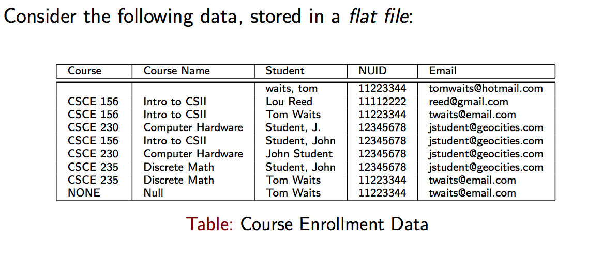
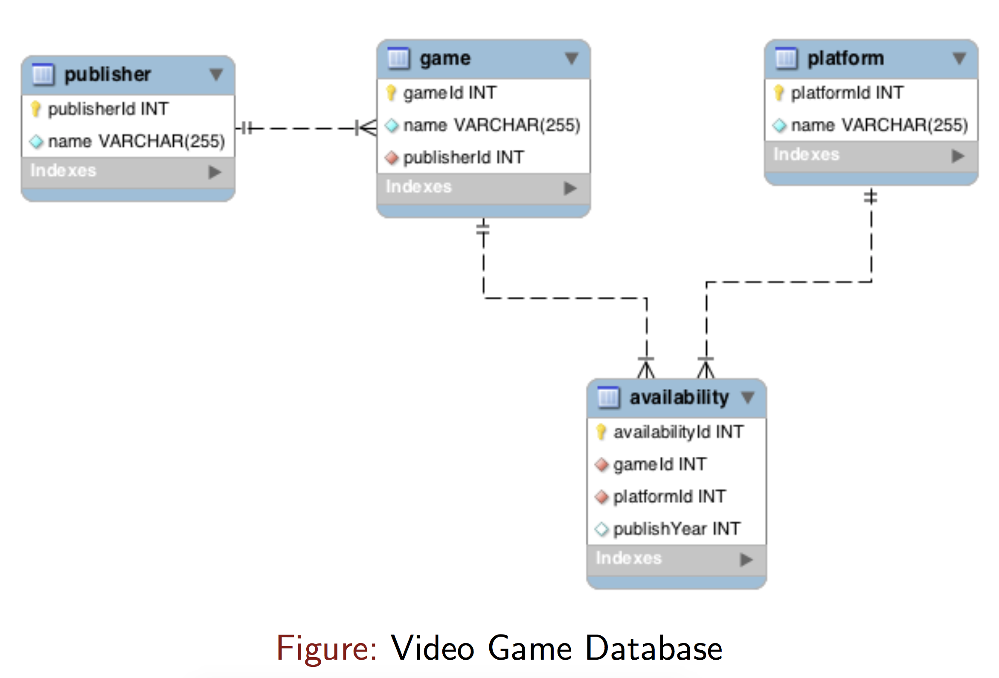

# Databases & SQL
## CSCE 156 - Spring 2020

### Introduction/Overview



* Flat data files are insufficient for storing data
  * Repetition of data
  * Formatting issues
  * Consistency issues
  * Integrity issues
  * Organization problems: not sorted, it is in one big file (no multithreaded or multiuser capability)
  * There is no security!

  
* Solution: use a RDBMS (Relational Database Management System)
  * 1970 Edgar Codd (1970, IBM)
  * Key aspects: data is stored in *tables*
  * Data is stored in columns (fields)
  * Records are stored as rows
  * Each row may have a unique identifier (Primary Key, PK)
  * Rows (records) in different tables may be related through Foreign Keys (FK)
  
* You can interact with a RDBMS through CRUD:
  * Create (`insert`)
  * Retrieve (`select`)
  * Update (`update`)
  * Destroy (`delete`)
  
## CRUD Demonstration



### C = Creating Data

* Creating data involves inserting new record(s) into a table
* You use the `insert` keyword

```sql
insert into publisher (name) values ("Activision");
insert into publisher (name) values ("Mojang");
  
-- insert multiple records with one query:
insert into platform (name) values
  ("Vive"),
  ("Index"),
  ("Oculus Quest");
```

* You can, but generally should *not*, hard code primary key values
* Key management is a difficult problem, let the database handle it 
* You can/should hardcode key values for initialization/test data though

```sql
insert into game (gameId, name, publisherId) values (102, "Minecraft", 16);
insert into game (name, publisherId) values ("Destiny 2", 14);
```

* You can use *nested queries* to avoid hardcoding key values

```sql
insert into game (name, publisherId) values ("Destiny 2",
  (select publisherId from publisher where name = "Activision"));
```

### U = Update

* You can alter existing records in a table
* Use the keyword `update`

```sql
update game set name = "Destiny II" where gameId = 103;
update game set name = "Destiny II" where gameId = 
  (select gameId from game where name = "Destiny 2");
```

* You should always do updates with a `where` clause to limit your changes
* Generally, "safe mode" will prevent such dangerous queries:   
* `update game set name = "Destiny II"` would change *every* game record!
* Style notes:
  * comments start with a `-- `(space)
  * keywords are case insensitive
  * old school style: use `ALL UPPER CASE`
  * modern style: use all `lower case`
  * you can align/go to the next line as necessary to avoid long lines 

### D = Destroy existing records

* To remove/delete records use the `delete` keyword
* Use a `where` clause to limit the damage

```sql
-- Delete every game, unsafe:
delete from game;
delete from game where gameId = 103;
```

### R Retrieve Records

* To retrieve records in a database, you use the `select` keyword
* Retrieve all game records:
`select * from game;`
* Retrieve all publisher records:
`select * from publisher;`
* The star operator selects *every column* from the table
* If you only want a subset of columns you can be explicit:
```sql
select name, publisherId from game;
-- sometimes its also helpful to rearrange and rename or "alias" your columns:
select name as gameTitle, 
		   publisherId as pubId 
from game;
```
* You can use basic logic operators using a `where` clause:

```sql
select * from game where gameId > 5 and gameId <= 10 or gameId = 1;
```

* You can also use string comparisons:

```sql
select * from game where name = "minecraft";
select * from game where name = "Minecraft";
```

* And also partial string comparisons, the `%` matches any character or characters (including none)

```sql
-- all games that begin with a G:
select * from game where name like 'G%';
-- all games that have 2 r's in them:
select * from game where name like '%r%r%';
-- any game that ends with a lower case g:
select * from game where name like '%g';
```

### Joins

* You can combine one or more tables by *joining* them together
* Should be joined using some criteria
* Usually tables are designed to have a foreign key/primary key relation 
* You join together tables `on` some criteria
* These are `inner join`s, but you can shorten it and just use `join`:

```sql
select * from game 
  join publisher on game.publisherId = publisher.publisherId;

-- you can shorten up a long query by aliasing the table names as well:
select g.name as gameTitle, 
       p.name as publisherName
from game g 
join publisher p on g.publisherId = p.publisherId;

-- join 3 tables:
select * from game g 
  join publisher p on g.publisherId = p.publisherId
  join availability a on a.gameId = g.gameId
  join platform pub on pub.platformId = a.platformId;
```

* A regular join does not preserve records in the (left) tables that have no matches in the (right) tables
* A `left outer join` or just `left join` will preserve all records in table A even if they have no matches in table B

```sql
select * from game g 
  left join publisher p on g.publisherId = p.publisherId
  left join availability a on a.gameId = g.gameId
  left join platform pub on pub.platformId = a.platformId;
```

* By design, a game cannot exist without a publisher
* A publisher may exist without having published any games
* To preserve publishers with no games, you must use a `left join`
* You can use a `right join` to preserve records from the (right) table back to the (left) table

```sql
select * from publisher p 
  join game g on p.publisherId = g.publisherId;

select * from publisher p 
  left join game g on p.publisherId = g.publisherId;

-- not necessary as a game cannot exist
-- without a publisher:
select * from publisher p 
  right join game g on p.publisherId = g.publisherId;
```

* We can flatten the game/platform data model: we'll report all games and all platforms they are available on

```sql
-- all games even with no availability
select * from game g
  left join availability a on g.gameId = a.gameId
  left join platform p on a.platformId = p.platformId;
  
-- all platforms even without games on them:  
select * from game g
  right join availability a on g.gameId = a.gameId
  right join platform p on a.platformId = p.platformId;
```

* If you want preservation in *both* directions, then you need to combine both *result sets* by taking their union ($A \cup B$)

```sql
select * from game g
  left join availability a on g.gameId = a.gameId
  left join platform p on a.platformId = p.platformId
union 
select * from game g
  right join availability a on g.gameId = a.gameId
  right join platform p on a.platformId = p.platformId;
```

### Modifiers

* To select only unique values you can use the
`distinct` keyword:

```sql
select publishYear from availability;
select distinct publishYear from availability;
```

* You can also use the `in` clause to define your own sets of values

```sql
select * from availability where publishYear = 1988 or publishYear = 2005 or publishYear = 1992;
select * from availability where publishYear in (1998, 2005, 1992);

-- comes in handy with a nested query:
select * from availability where publishYear in 
  (select publishYear from availability where gameId > 10);
```

* You can arrange/sort the results using an `order by` clause

```sql
select publishYear from availability;
select * from availability order by publishYear;
select * from availability order by publishYear asc;
select * from availability order by publishYear desc;

select * from game g
  left join availability a on g.gameId = a.gameId
  left join platform p on a.platformId = p.platformId
  order by p.name asc, g.name desc;

```

### Aggregates

* You can do basic math/computation using SQL

```sql
-- count the number of records:
select count(*) as numberOfGames from game;
-- find the oldest game:
select min(publishYear) from availability;
-- find the newest game:
select max(publishYear) from availability;
-- find an average:
select avg(publishYear) from availability;
-- find a sum:
select sum(publishYear) from availability;
-- mix and match arithmetic/math functions:
select round(min(publishYear) / max(publishYear)) from availability;
```

#### Data Projection

* Goal: for each publisher: how many games did they publish?
* Need to perform a *data projection*
* Group publishers together and collapse (project) them down, summing the number of records
* Use the `group by` clause
* Can filter before projection using `where`
* Can filter after projection using `having`

```sql
select * from publisher p 
  left join game g on p.publisherId = g.publisherId;
  
select p.name, count(g.gameId) as numGames from publisher p 
  left join game g on p.publisherId = g.publisherId
  where p.name > "Nintendo"
  group by p.name
  having numGames <= 5 and numGames > 2
  order by numGames desc;

```

## Creating Tables

* Let's design a database to hold film data

```sql

create table Film (
  filmId int primary key not null auto_increment,
  title varchar(255) not null,
  releaseDate varchar(50) not null default '0000-00-00',
  grossEarnings double,
  imbdRating float,
  eidr varchar(100) unique key 
);

-- issues:
-- 1. We dont' want our database identifiers to be dependent on external entities
-- 2. We still want to keep track of the external ID (eidr, ssn, nuid, etc.) or "natural keys"
-- 3. we need to make sure that the external "natural" key is unique

```
